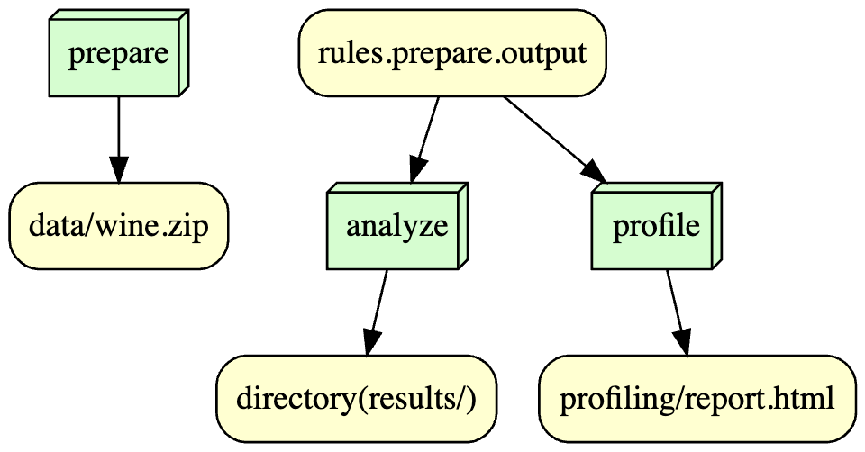

# Reproduction of Wine: IS 477 Final Project

# Overview
This project centers on the analysis of a wine dataset that includes the results of a chemical analysis of wines from the same region in Italy but derived from three different cultivars. The focus is to utilize these chemical features to classify the wines accurately.
The dataset comprises 178 instances with 13 attributes. These attributes are key chemical constituents such as Alcohol content, Malic Acid, Ash, and others, which are significant for distinguishing between the types of wine. The attributes have been narrowed down from an initial set of around 30 variables due to the loss of the complete list and the inability to determine which of the 13 variables were included in the original set.
A notable outcome of the project is the classification accuracy of 1.0, indicating perfect predictions by the classifier. This level of accuracy suggests that the features selected for the model are highly indicative of the wine's cultivar.
The histogram provided shows the distribution of alcohol content among the wines, revealing a central tendency around 13%. It exhibits a roughly bell-shaped, normal distribution, which indicates that most wines have a moderate alcohol percentage with fewer instances of very high or very low alcohol content.
The summary statistics were computed to provide insights into the central tendency, dispersion, and shape of the dataset's distribution. These statistics include measures such as mean, median, mode, standard deviation, variance, skewness, and kurtosis for each chemical attribute. They serve as a foundational step in understanding the data's structure before applying any classification algorithms.
The combination of classification accuracy, the histogram of alcohol content, and summary statistics forms a comprehensive initial exploration into the dataset. This exploration determines the suitability of the dataset for classification tasks and provides a baseline for further analysis.
Overall, the project underscores the potential of machine learning in viticulture, particularly in classifying and authenticating wines based on their chemical fingerprints.

# Analysis
The analysis of the wine dataset was conducted with a focus on chemical composition to classify the origin of wines. The model's classification accuracy reached 100%, which is 1.0, indicating that the chemical attributes selected are highly predictive of the wine's cultivar. The histogram of alcohol content, one of the key features, showed a normal distribution with the majority of wines having an alcohol content around the central peak of approximately 13%. Summary statistics complemented these findings by quantifying the central tendencies and variability within each chemical attribute. For instance, the mean and median levels of malic acid provided insights into the acidity profile of the wines, while the standard deviation for magnesium levels indicated the diversity in mineral content. These numerical insights are critical for understanding the physiochemical landscape of the wines, ultimately guiding the classification process.

# Workflow Section

# Reproducing
In order to reproduce the environment and run the script, follow these steps below:

1. My environment information:
Read environment.log for the environment information

2. Install Dependencies: Make sure you have Python and the required libraries installed:
Code: "pip install -r requirements.txt"
The requirements.txt contains the basic list of required libraries in order to reproduce

3. Data Preprocessing: Run the data preprocessing script to prepare the data for analysis:
Code: "python prepare_data.py"

Workflow: In order to reproduce run codes below
snakemake --cores 1 profile
snakemake --cores 1 analysis 

# License
Software License 
- MIT License

Data License 
- Creative Commons Attribution 4.0 International (CC BY 4.0)

Wine Data
- Own License(Creative Commons Attribution 4.0 International (CC BY 4.0))

MIT license is permissive open source software license. This license allow to use, distribution and modification of my code for any purpose, while it gives me credit for my work. Also, MIT license is used mainly for research and academic purposes. 

# Reference
Citation:
Wine: Aeberhard,Stefan and Forina,M.. (1991). Wine. UCI Machine Learning Repository. https://doi.org/10.24432/C5PC7J.

